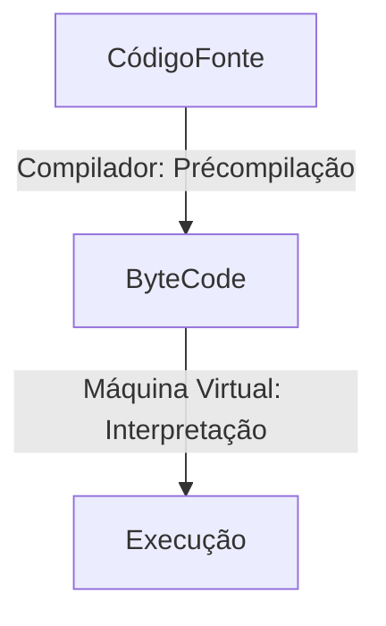

# Programação Híbrida 

### Quais são as linguagens de programação Híbridas?

* Java(JVM)
* C#(Microsoft .NET Framework)
* Visual Basic
* F#
* Erlang

### Como funciona a linguagem Híbrida?

 > A linguagem Híbrida utiliza um compilador e um interpretador.
Compilando o códio-fonte de alto nível para um código de baixo nível, o Bytecode. Após isso, usa o interpretador para executar esse Bytecode.

Na linguagem Híbrida o código fonte é précompilado no compilador(**javac**) onde passa pelas análises léxica e sintática transformando o código fonte em um código intermediario, o Bytecode(**.class**).
A Máquina Virtual do Java (JVM), encarregada do gerenciamento de memória e recursos, a fim de executar o programa de maneira que ele seja compreendido pelo sistema operacional em que está rodando, irá interpretar esse Bytecode transformando-o em um executável(.exe), o código de máquina.

### Mas o que é Bytecode?
Bytecode é um formato de código intermediário entre o código fonte, o texto que o programador consegue manipular, e o código de máquina, que o computador consegue executar.
Tem como extensão o *.class*

